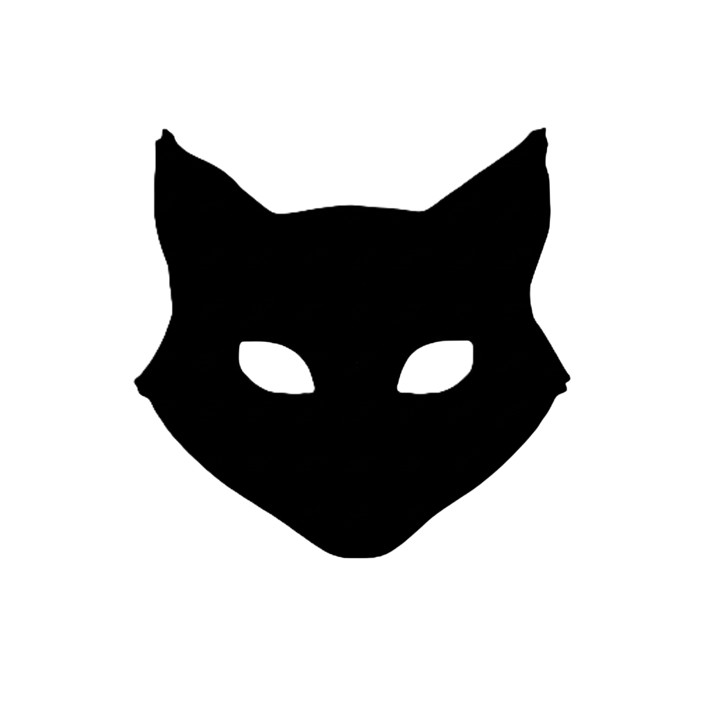
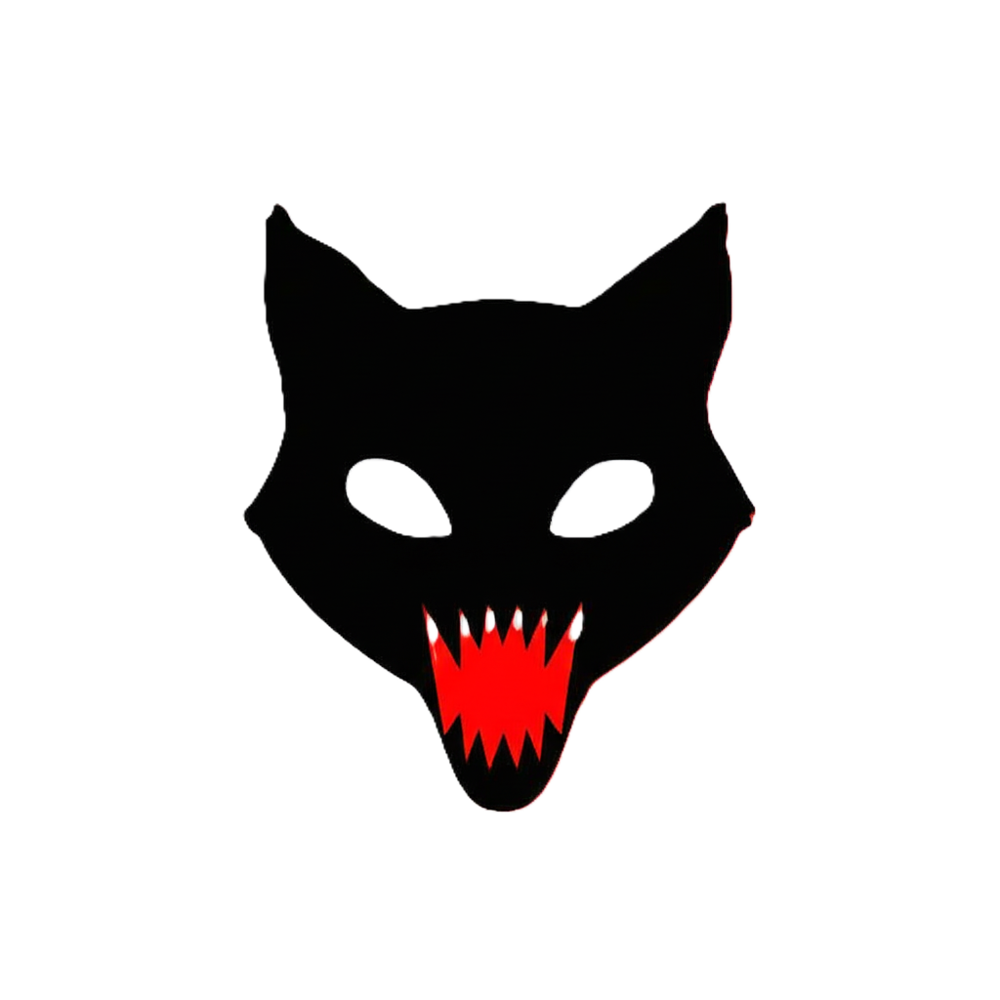

# 🎃 Stigween — Gato Macabro 👻

Site temático de Halloween, feito com **Next.js**, com um gato animado, interativo e assustador.  
Inclui sistema de ingressos promocionais, integração com **Mercado Pago**, envio de e-mails com lista de convidados, e efeitos visuais como gotas de sangue, sons, animações e formulário.

---

## ✨ Funcionalidades

- 🐱 Gato macabro com olhos que seguem o cursor
- 💀 Gato abre a boca ao clicar no ingresso, exibindo  som de miado
- 🩸 Gotas de sangue caindo pela tela
- 🎟️ Formulário automático para convidados com nome, e-mail e mensagem
- 📨 Envio da lista de convidados por e-mail para o organizador
- 💰 Integração com **API Mercado Pago** para processar pagamentos dos ingressos
- 📊 Webhooks para confirmação de pagamento

---

## 📂 Estrutura do projeto

```
/
├── .next/                        # Build gerada pelo Next.js
├── node_modules/
├── public/
│   └── (imagens, sons, etc)
├── src/
│   ├── components/
│   │   ├── Ads.js
│   │   ├── EventCard.js
│   │   ├── Header.js
│   │   ├── Morcego.js
│   │   └── SangueChuva.js
│   ├── lib/
│   │   └── mongodb.js           # Conexão com MongoDB (se aplicável)
│   ├── pages/
│   │   ├── api/
│   │   │   ├── check-payment.js
│   │   │   ├── create-order.js
│   │   │   ├── payment.js         # Inicia pagamento no Mercado Pago
│   │   │   ├── update-payment.js
│   │   │   └── webhook.js       # Webhook do Mercado Pago
│   │   ├── event/
│   │   │   └── [id].js          # Página dinâmica para eventos
│   │   ├── _app.js
│   │   ├── _document.js
│   │   └── index.js             # Página principal com o gato
│   └── styles/
│       ├── Ads.module.css
│       ├── globals.css
│       ├── Home.module.css
│       ├── Morcego.module.css
│       └── SangueChuva.module.css
├── .env.local
├── README.md
├── package.json
├── next.config.js
├── next.config.mjs
├── tsconfig.json
├── jsonconfig.json
```

---

## 🚀 Como rodar localmente

1️⃣ Clone o repositório:
```bash
git clone https://github.com/seu-usuario/stigween.git
```

2️⃣ Instale as dependências:
```bash

npm install
```

3️⃣ Configure as variáveis de ambiente:
Crie um arquivo `.env.local` com:
```env
MERCADO_PAGO_ACCESS_TOKEN=seu_token_mercado_pago
EMAIL_USER=seu_email@gmail.com
EMAIL_PASS=sua_senha_ou_app_password
EMAIL_TO=email_organizador@gmail.com
SHEETS_WEBHOOK_URL=link do seu formulário
```

4️⃣ Inicie o servidor:
```bash
npm run dev
```

5️⃣ Acesse:
```
http://localhost:3000
```

---

## 📸 Funcionalidades visuais

| 🐱 Gato com olhos seguindo o mouse | 💀 Gato com boca aberta | 
|-------------------------------------|--------------------------|---------------|------------------|
|  | |


## 📝 Notas sobre integrações

- 💰 **Mercado Pago**: 
  - Endpoint `/api/pagar.js` cria um pagamento
  - Webhook `/api/webhook.js` recebe notificações do status do pagamento
  - Outros arquivos relacionados: `create-order.js`, `update-payment.js`, `check-payment.js`
- 📧 **E-mail**:
  - Envia automaticamente os dados preenchidos no formulário para o e-mail do organizador.
  - Usa `EMAIL_USER` e `EMAIL_PASS` do `.env.local` para autenticar.
- 📜 **Formulário**:
  - Formulário integrado com o webhook, automatizado com o nome dos pagantes.

---

## 🔗 Tecnologias

- Next.js
- React
- HTML5 + CSS3
- Mercado Pago API
- Nodemailer
- MongoDB (opcional, dependendo do `lib/mongodb.js`)

---

## 📄 Licença

Projeto para fins educacionais e demonstração.  
Sinta-se à vontade para contribuir ou adaptar para seus próprios eventos.

## 👨‍💻 Criador

William D. Barreto
